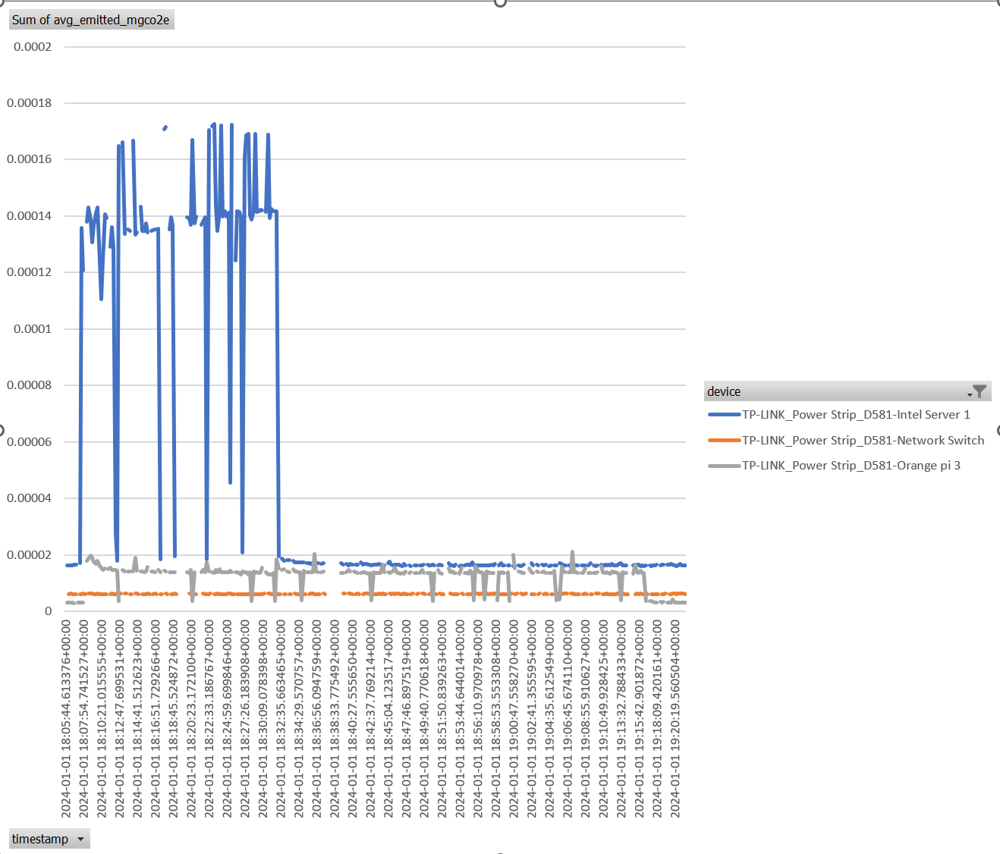

[](https://badge.fury.io/py/kasa-carbon)

# kasa_carbon
Show CO2 emissions of devices connected to a Kasa energy meter or TP-link/Omada Power over Ethernet switch.  This project depends on and extends the python-kasa project which you can see here: https://python-kasa.readthedocs.io/en/stable/.  It requires a supported Kasa brand plug or an TP-Link/Omada branded power over Ethernet switch.

# Quickstart instructions (file mode)
This utility is installed as a python module.  Its recommended to install within a python virtual environment such as conda.  For the example below I'll be using conda. 

Currently the application supports getting carbon intensity data from Electricity Maps and you'll need an api key here https://www.electricitymaps.com/pricing.  The plan for personal non-commercial use is what has been tested.  

```bash
conda create -n kasa python=3.12
conda activate kasa
pip install kasa-carbon
kasa-carbon --storage=file --em_api_key=<your electricity maps api key> --em_cache_expiry_mins=30 --local_lat=<latitude of the device under test> --local_lon=<longitude of the device under test>
```

You will see console output like the following: 
```
The energy monitoring task is still running.
['TP-LINK_Power Strip_D581-Orange pi 1,2023-12-05 00:24:39.716662+00:00,1.387,3.0513999999999997e-06,528.0\n', 'TP-LINK_Power Strip_D581-Plug 1,2024-01-01 16:53:37.793121+00:00,3.11,6.2588749999999994e-06,483.0\n', 'TP-LINK_Power Strip_D581-Plug 2,2024-01-01 16:53:37.794128+00:00,0.0,0.0,483.0\n', 'TP-LINK_Power Strip_D581-Plug 3,2024-01-01 16:53:37.794128+00:00,8.009,1.61181125e-05,483.0\n', 'TP-LINK_Power Strip_D581-Plug 4,2024-01-01 16:53:37.794128+00:00,1.5,3.01875e-06,483.0\n', 'TP-LINK_Power Strip_D581-Plug 5,2024-01-01 16:53:37.794128+00:00,1.707,3.4353375e-06,483.0\n', 'TP-LINK_Power Strip_D581-Orange pi 1,2024-01-01 16:53:37.795126+00:00,1.624,3.2683e-06,483.0\n']
```

The monitoring task will run until killed while appending the readings to the output file.

# Command Line Options
    -h, --help            show this help message and exit
    --energy-device {kasa,omada}
                        Energy device to monitor
    --storage {database,file}
                        Storage method
    --file-path FILE_PATH
                        File path for file storage
    --file-mode {append,overwrite}
                        File mode for file storage append will continuously append and overwrite will only keep the most recent value
    --db_host DB_HOST     Database host
    --db_port DB_PORT     Database port
    --db_user DB_USER     Database user
    --db_password DB_PASSWORD
                        Database password
    --db_name DB_NAME     Database name
    --db_view_user DB_VIEW_USER
                        Database view user
    --em_api_key EM_API_KEY
                        API key
    --em_cache_expiry_mins EM_CACHE_EXPIRY_MINS
                        Carbon Data cache expiry in minutes
    --local_lat LOCAL_LAT
                        Local latitude
    --local_lon LOCAL_LON
                        Local longitude
    --update_interval_sec UPDATE_INTERVAL_SEC
                        Update interval in seconds

# Database mode
There is also a more advanced database mode.  You can deploy the required postgres database to a docker container using the provided docker-compose.yml file in the source.  
There are several parameters which are required for this which can be read from environment variables.  Here are some recommended values.
```python
DB_HOST=host.docker.internal
DB_PORT=5432
DB_USER=postgres
DB_PASSWORD=<create an admin password>
DB_NAME=kasa_carbon
DB_VIEW_USER=energy_view_user
DB_VIEW_USER_PASSWORD=<create readonly a password>
```

With the database running in the docker container you can launch the application using the relevant database parameters like:
'kasa-carbon --db_host=host.docker.internal --db_port=5432 --db_user=postgres --db_password=<admin password> --db_name=kasa_carbon --db_view_user=energy_view_user --em_api_key=<your electricity maps api key> --em_cache_expiry_mins=30 --local_lat=39.633971 --local_lon=-105.329563

# Example output
Here is an example of using excel to graph the output obtained while running two instances of the Phoronix Apache Benchmark across both a Orange Pi and an Intel NUC.  I've only plotted mgCO2e on this chart but watts is also an available reading.  I live in a place with relatively low variability in our grid carbon intensity but had the co2/kwhr changed in the local grid during the course of this test it would have impacted the co2 data but not the power data.

The full example table is also available at (visualization/energy_usage.xlsx)

# Notes
I haven't seen any calibration information on these plugs but I do know that when doing measurements for SERT or Energy Star or other compliance focused energy measurement a calibrated energy monitor is a requirement.  So I don't recommend using this for any official compliance work.

# Development instructions
You can run the project from source as 
'python -m kasa_carbon.kasa_carbon_main

more instructions coming . . . 

